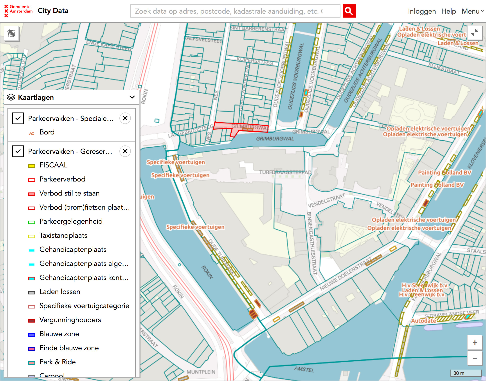
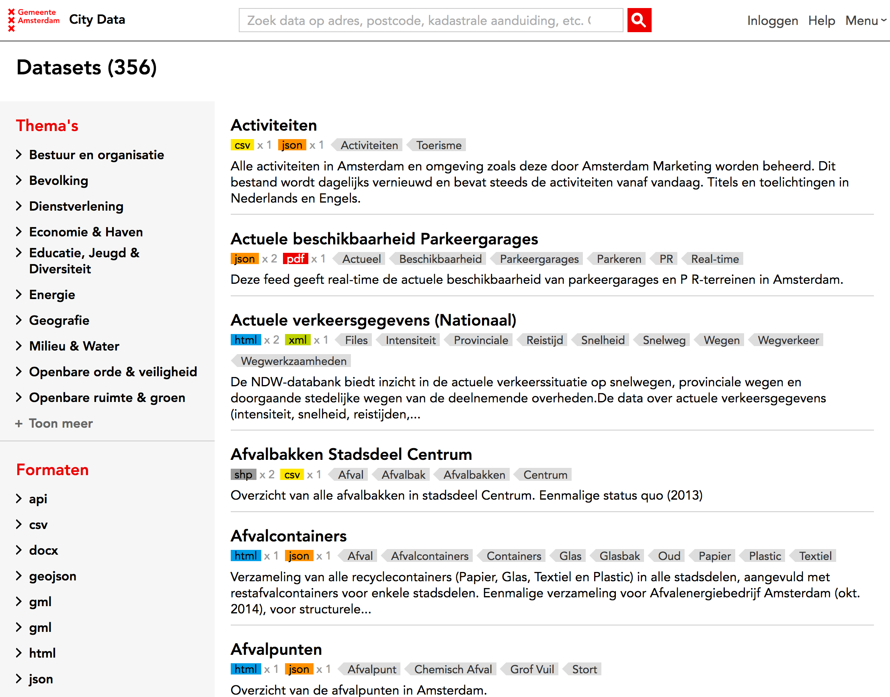

# Atlas

The interface for all APIs – Open Data and internal – offered by Amsterdam City Data.

Atlas is deployed at [data.amsterdam.nl](https://data.amsterdam.nl).

The source code for Atlas is at the [GitHub repository: Amsterdam/atlas](https://github.com/amsterdam/atlas)

## Features

### A big map with all the API data on it

The [Map](https://data.amsterdam.nl/#?lse=T&mpb=topografie&mpz=11&mpfs=T&mpv=52.3731081:4.8932945&pgn=home) is the centrepiece of Atlas. Some of its features:

* The official City of Amsterdam basemap.
* Yearly aereal photographs from 2003 up to now.
* Multiple layers with all of the data from the City Data APIs.
* Clicking on a location or object on the map reveals the inspector with all available data.
* 360° Street View for most objects, [Open Panorama 360° street view](open-panorama.md).
* Ability to draw a polygon and get the information for all objects inside of it.

### Developer information

An overview of [API documentation](https://data.amsterdam.nl/#?mpb=topografie&mpz=11&mpv=52.3731081:4.8932945&pgn=content-overzicht&pgt=apis), and an overview of all Amsterdam City Data [REST APIs, their documentation and status](https://api.data.amsterdam.nl/api/).

### Catalogue of third party datasets

An overview of third party of available datasets. Sortable by theme and format. With information about every dataset about who is maintaining it, what licence it is published under and where it is located.

### Progressive disclosure

Civil servants with the City of Amsterdam can log in to Atlas and view the information they have the rights to.

Authentication is done with the [OAuth 2.0 authentication service Authz](authz.md).

### Typeahead search

Atlas features a single search field with Typeahead that suggests results from multiple APIs and data sources.
