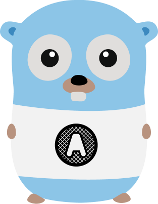

# Authz

An [OAuth 2.0](https://tools.ietf.org/html/rfc6749) compatible authorization service written in Go.

This service:

* Implements the implicit flow as described in [RFC6749 section 4.2](https://tools.ietf.org/html/rfc6749#section-4.2)
* Uses JSON Web Keys ([RFC7517](https://tools.ietf.org/html/rfc7517)) for key management
* Creates JSON Web Tokens ([RFC7519](https://tools.ietf.org/html/rfc7519)) using HMAC or ECDSA (HS256, HS384, HS512, ES256, ES384, ES512)
* Provides interfaces for identity providers, state storage (with implementations for single node in-memory storage and Redis), authorization providers (to map users to scopes) and client registries.

For more information on how to use, check out the [GitHub repository: Amsterdam/authz](https://github.com/Amsterdam/authz) or the [Documentation on GoDoc](https://godoc.org/github.com/Amsterdam/authz/oauth2).

## Admin backend

Alongside the Authz service we created an [Admin backend (GitHub repository: Amsterdam/authz_admin)](https://github.com/Amsterdam/authz_admin) to map OAuth 2.0 scopes to profiles that map to roles provided by your Identity Provider.

---

<small>The Gopher OAuth illustration is based on the Go Gopher by [Takuya Ueda](https://twitter.com/tenntenn) ([CC-BY](http://creativecommons.org/licenses/by/3.0/deed.ja)) and the OAuth logo by [Chris Messina](https://www.flickr.com/photos/factoryjoe/1416054260/) ([CC-BY-SA](http://creativecommons.org/licenses/by-sa/3.0/)).</small>