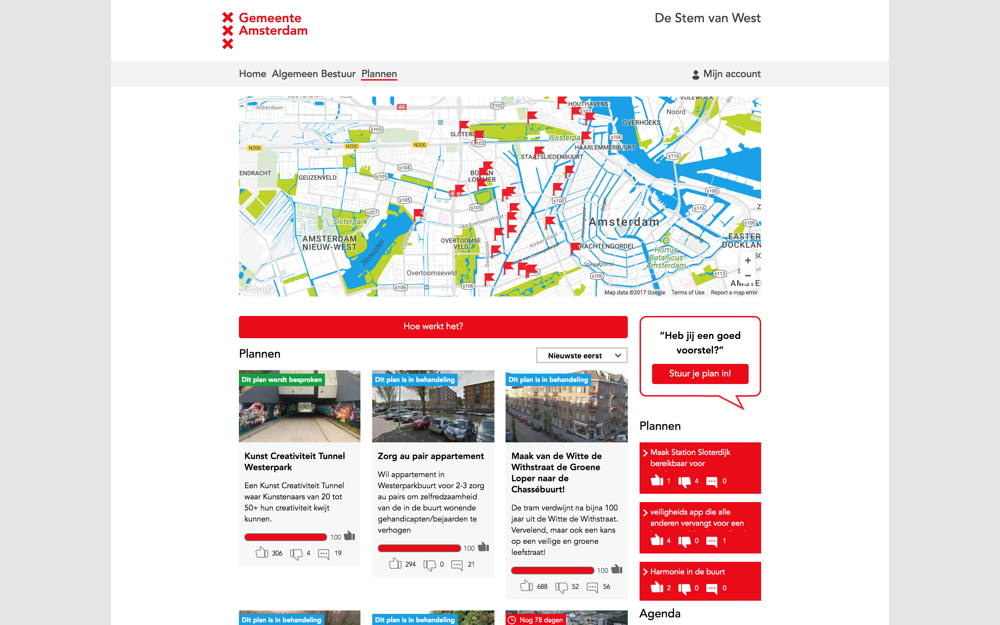

# De Stem Van

The participation platform 'De Stem Van' was originally developed to give the citizens of the Stadsdeel West borough of Amsterdam the ability to put items on the political agenda. 

Citizens can poll and upload ideas for the neighborhood. After this they can campaign for their plan. Once per month, at a pre-set date, the votes are counted and the plan with the most votes is selected. This plan is automatically put on the agenda of the borough council.

The homepage of De Stem Van features stories with photos and videos of citizens that have presented plans to city council and interviews with local politicans to inspire input and inform about the possible outcomes.

De Stem Van has since development been implemented in several other boroughs in Amsterdam.

For more information on De Stem Van, check out the [GitHub repository: OpenStadsdeel/stemvan](https://github.com/OpenStadsdeel/stemvan)
