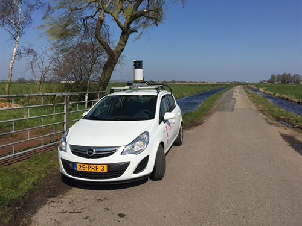

# Open Panorama

An end to end solution for processing, normalisation, anonymisation and serving 360° street view panoramas. From raw files to API.

At the City of Amsterdam, our civil servants need access to up to date street view images to do their job. We drive through the city multiple times per year to get the latest images. We've built Open Panorama to turn the photos we take into a server that serves 360° panorama images over the web.

You can see the 360° panorama images of the streets of Amsterdam on [data.amsterdam.nl](https://data.amsterdam.nl/#?mpb=topografie&mpz=11&mpo=pano::T&mpv=52.3714749:4.898476&sbf=Cu&sbh=5E&sbi=TMX7316010203-000222_pano_0000_000282&sbl=ZRJhS:3JV8j&sbp=c).

For more information on how to use, check out the [GitHub repository: Amsterdam/panorama](https://github.com/Amsterdam/panorama)

## What Open Panorama does

Open Panorama does not attach any cameras to your car and does not drive around the city to take the photos; you still have to do that yourself. However, Open Panorama does do most of what follows:

1. **Import panoramas**: from an ObjectStore including metadata CSVs into a database.
2. **Normalisation**: images are edited to face northwards and have a straight horizon.
3. **Image recognition and blurring**: finding sensitive data like people and licence plates and blurring those. With Docker Swarm cluster support.
4. **Create tiles**: for faster loading and less client-intensive use in viewers (like our own PanoViewer, and/or Marzipano and other viewers) the blurred 360° panorama images are reprojected and turned into tiles.
5. **Serving over APIs**: A server that provides API endpoints in Rest and OGC (WMS/WFS) for the locations, metadata and the tiles. As well as a REST-API to get a thumbnail for a certain location.

## Using the Panoramas

We've published [a JavaScript library](panoviewer.md) that is built on [Marzipano](http://www.marzipano.net/) and allows others to integrate our Amsterdam streets into their sites.
