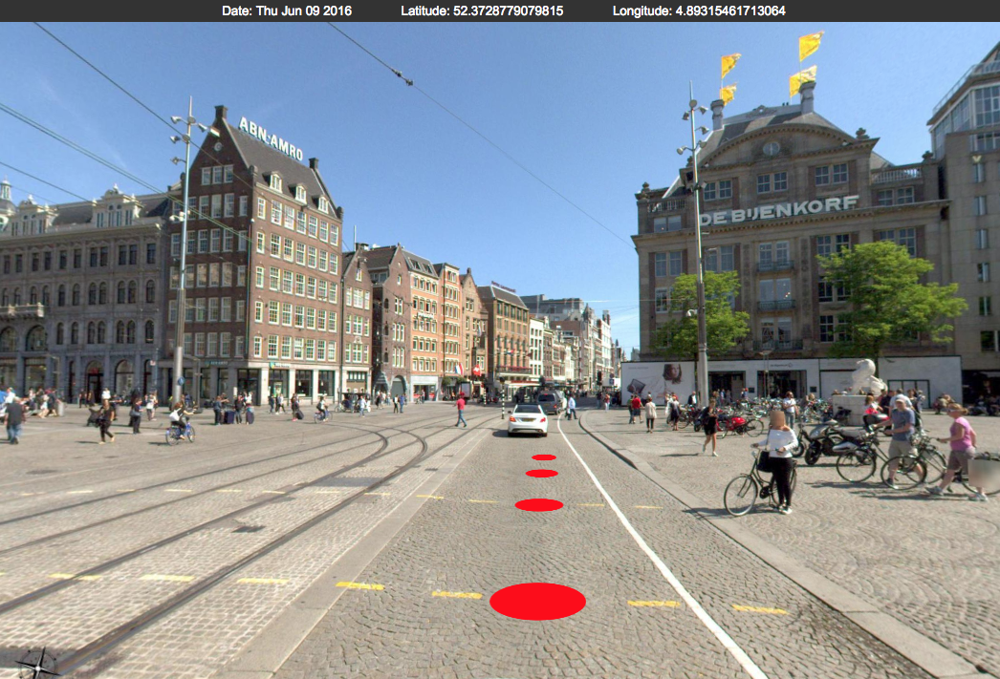

# PanoViewer

A javascript library to display interactive 360° street view panorama images of Amsterdam, Almere and Amstelveen and navigate between them.

For more information on how to use, check out the [GitHub Repository: Amsterdam/PanoViewer](https://github.com/Amsterdam/PanoViewer).

## Demos

* [Simple 360° street views of Amsterdam, Almere and Amstelveen](https://panoviewer.data.amsterdam.nl/demo/) 
* Integrated in the [Amsterdam City Data Portal](https://data.amsterdam.nl/#?mpb=topografie&mpz=11&mpo=pano::T&mpv=52.3730353:4.8932471&pgn=home&sbf=Cu&sbh=-Lc&sbi=TMX7315120208-000073_pano_0005_000449&sbl=ZRWBl:3JJZP).

## Panorama processing and serving

The 360° panorama tiles that are used in this viewer are created with our [Open Panorama project](open-panorama.md).