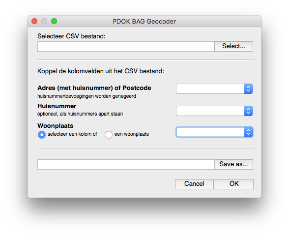

# PDOK BAG Geocoder QGIS Plugin

The PDOK BAG Geocoder plugin for QGIS converts Dutch adresses to coordinates on a map. The plugin reads a CSV file and returns a georefenced Shapefile. The plugin uses the PDOK Geocoder API.

The code for the QGIS PDOK BAG Geocoder is at the [GitHub repository: Amsterdam/pdokbaggeocoder](https://github.com/Lytrix/pdokbaggeocoder) and [Geonovum offers documentation](https://pdok-ngr.readthedocs.io/handleidingen.html?highlight=geocoder).